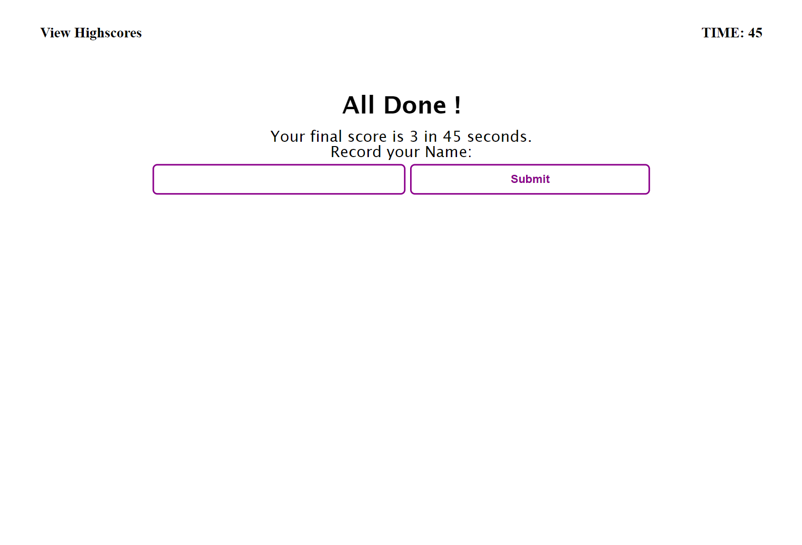

# Code Quiz

## About the Projects

In order to prepare for yourself in your interview process to become a full-stack web developer, you will need to learn and pass the code quiz assessment with both multiple-choice questions and interactive coding challenges. To help familiarize you with these tests and allow you to use the skills covered in this module, this app will provides sample questions regarding to html, css and javascript.

## Features

```
- Different questions will be shown for users to answer.

- The total correct answer (and the time) will be kept tracks as the score. Users can access to your scores at the end of the quiz or through nav link "View Highscores" on the top of the page.

- When the quiz starts, a time limit will be set and count down. Reminded that users will be subtracted a certain time out from the timer clock.

- After finishing the quiz, users can save their scores (number of correct answers and the time) along with their name or initials.

- Users can clear their records at the highscore board.
```

## Deployment
Please follow [https://odthientho.github.io/w4c-code-quiz](https://odthientho.github.io/w4c-code-quiz/) to the deployed Code Quiz site.


## Screenshots
Main Page:


Code Quiz Questions:


Recording Scores:


View Highscores:


